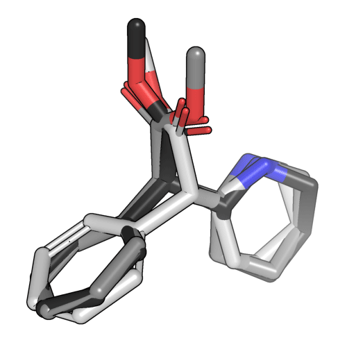

Pipeline Methods
================

E3FP can be easily plugged into an existing pipeline using the methods in the
`e3fp.pipeline` module. Each of these methods wraps functionality in other
modules for generating various outputs from inputs and specified options.

.. note::

    As fingerprinting many molecules is embarrassingly parallel, we highly
    recommend employing a parallelization strategy. We use our own
    python_utilities_ package.

First we must choose configuration options. See :ref:`Configuration` for
detailed instructions. Here we will use defaults for all but a few options.

.. testsetup:: *

    smiles_file = "source/examples/data/test_smiles.smi"

.. doctest::

    >>> fprint_params = {'bits': 4096, 'radius_multiplier': 1.5, 'rdkit_invariants': True}
    >>> confgen_params = {'max_energy_diff': 20.0, 'first': 3}
    >>> smiles = "COC(=O)C(C1CCCCN1)C2=CC=CC=C2"

Generating Conformers from SMILES
---------------------------------

The following code snippet generates a multi-conformer molecule:

   >>> from e3fp.pipeline import confs_from_smiles
   >>> mol = confs_from_smiles(smiles, "ritalin", confgen_params=confgen_params)
   >>> mol.GetNumConformers()
   3

This produces the following conformers:

Generating Fingerprints from Conformers
---------------------------------------

   >>> from e3fp.pipeline import fprints_from_mol
   >>> fprints = fprints_from_mol(mol, fprint_params=fprint_params)
   >>> len(fprints)
   3
   >>> fprints[0]
   Fingerprint(indices=array([188, 224, ..., 3775, 4053]), level=5, bits=4096, name=ritalin_0)
   >>> fprints[1]
   Fingerprint(indices=array([125, 188, ..., 3693, 4053]), level=5, bits=4096, name=ritalin_1)
   >>> fprints[2]
   Fingerprint(indices=array([188, 206, ..., 3743, 4053]), level=5, bits=4096, name=ritalin_2)

Generating Fingerprints from SMILES
-----------------------------------

   >>> from e3fp.pipeline import fprints_from_smiles
   >>> fprints = fprints_from_smiles(smiles, "ritalin", confgen_params=confgen_params, fprint_params=fprint_params)
   >>> fprints[0]
   Fingerprint(indices=array([188, 224, ..., 3775, 4053]), level=5, bits=4096, name=ritalin_0)

Parallel Fingerprinting
-----------------------

The following script demonstrates use of python_utilities_ for fingerprinting
all SDF files in a directory in parallel. This essentially is the same as the
:ref:`Fingerprinting CLI`, albeit with a less convenient interface.

    >>> from glob import glob
    >>> from python_utilities.parallel import Parallelizer
    >>> from e3fp.conformer.util import smiles_to_dict
    >>> smiles_dict = smiles_to_dict(smiles_file)
    >>> print(smiles_dict)
    {'CHEMBL1643866': 'CCCC[C@H](CN(O)C=O)C(=O)[C@@H](NC(=O)C(C)C)C(C)C', ...}
    >>> len(smiles_dict)
    10
    >>> smiles_iter = ((smiles, name) for name, smiles in smiles_dict.items())
    >>> kwargs = {"confgen_params": confgen_params, "fprint_params": fprint_params}
    >>> parallelizer = Parallelizer(parallel_mode="processes")
    >>> fprints_list = parallelizer.run(fprints_from_smiles, smiles_iter, kwargs=kwargs) # doctest: +SKIP
    >>> len(fprints_list) # doctest: +SKIP
    10

For all pipeline methods, please see the `e3fp.pipeline` module API.

.. include:: ../substitutions.rst
